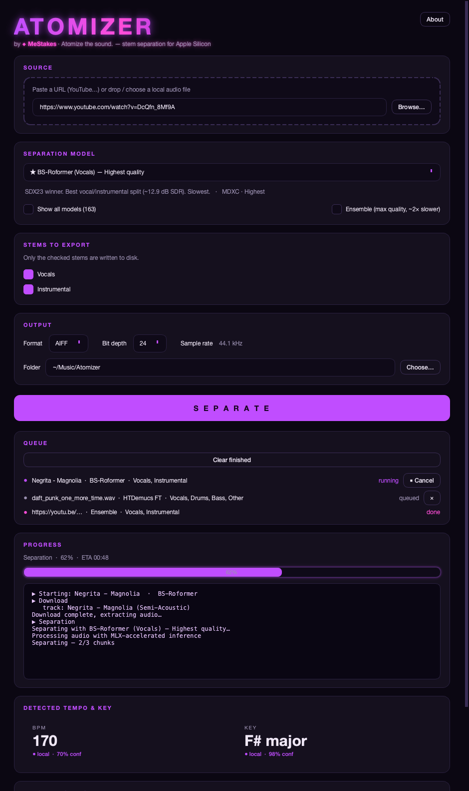

<div align="center">

# ⚡ ATOMIZER

**Atomize the sound.** — Local-first audio **stem separation** for Apple Silicon.

**🇬🇧 English**  ·  [🇮🇹 Italiano](README.it.md)


Split any song into stems (vocals, drums, bass, …) with the best open-source
models, GPU-accelerated on Apple Silicon via **MLX/Metal**. Download from a URL
or a local file, auto-detect **BPM** and **key**, and export files ready for
Apple **MainStage's Playback** plugin.

<sub>No cloud. No CUDA. Your audio never leaves your Mac.</sub>

<br>



</div>

---

## ✨ Features

- 🎚️ **Top-tier separation** — BS-Roformer & MelBand-Roformer (SDX23 winners),
  HTDemucs FT (4-stem) and HTDemucs 6s (+guitar/piano). 163 models in total.
- 🍎 **Apple Silicon native** — runs on the GPU via MLX/Metal. No PyTorch/ONNX at
  inference, no CUDA.
- 🔗 **URL or file** — paste a YouTube (etc.) link or drag-and-drop a local file.
- 🥁 **Pick your stems** — export only the stems you check.
- 🎼 **BPM + key detection** — online lookup first (optional API key), automatic
  local fallback (librosa / Krumhansl-Schmuckler). Always shows source + confidence.
- 📋 **Job queue** — start one separation and queue more while it runs; cancel or
  remove jobs anytime.
- 📊 **Real progress + ETA** — true per-chunk percentage and time-remaining during
  inference.
- 🎧 **Preview & export** — audition stems, then export **AIFF/WAV 24-bit/44.1 kHz**
  into a tidy per-song folder with an `info.json` sidecar.
- 🎯 **MainStage-ready metadata** — AIFF exports embed an Apple Loops `basc` chunk
  (tempo + key) so MainStage can auto-detect them; WAV gets an `acid` tempo chunk;
  `info.json` is always written too.
- 🌃 **Neon cyber UI** — dark, futuristic PySide6 interface.
- 🔒 **Private** — separation is fully local/offline; only the optional BPM/key
  lookup touches the network.

---

## 🚀 Quick start

> **Requirements:** Apple Silicon Mac (M1/M2/M3/M4), macOS 13+, [Homebrew](https://brew.sh).

### Option A — with git

```bash
git clone https://github.com/MeStakes/Atomizer.git
cd Atomizer
./setup.sh
source .venv/bin/activate
python -m atomizer.main
```

### Option B — without git (download the ZIP)

1. Open **https://github.com/MeStakes/Atomizer** → green **Code** button → **Download ZIP**
   (or use the [direct link](https://github.com/MeStakes/Atomizer/archive/refs/heads/main.zip)).
2. Double-click the downloaded `Atomizer-main.zip` to unzip it (e.g. in *Downloads*).
3. Open the **Terminal** app and run:

```bash
cd ~/Downloads/Atomizer-main      # the unzipped folder
bash setup.sh
source .venv/bin/activate
python -m atomizer.main
```

> Tip: if Homebrew isn't installed yet, paste this in Terminal first:
> `/bin/bash -c "$(curl -fsSL https://raw.githubusercontent.com/Homebrew/install/HEAD/install.sh)"`

Either way, `setup.sh` does everything:

1. installs **ffmpeg** (Homebrew),
2. creates a Python **3.12 virtualenv** and installs all dependencies,
3. creates `.env` from the template,
4. **pre-downloads the recommended model checkpoints** so the app is ready to run
   offline with no first-use wait.

> The model download is a few GB the **first time only** — checkpoints are cached
> under `~/Library/Caches/Atomizer/models` and reused forever after (they survive
> reboots). To skip it and let models download lazily on first use instead:
> `./setup.sh --no-models`.

Pre-download (or top up) models anytime:

```bash
python -m atomizer.bootstrap          # all recommended models
python -m atomizer.bootstrap --list   # show what would be downloaded
```

---

## 🎛️ Using Atomizer

1. **Paste a URL** or **drop / choose** a local audio file.
2. Pick a **separation model** (default = BS-Roformer, best vocals). Toggle
   *Show all models* for the full catalogue, or *Ensemble* for maximum quality
   (runs two models and averages them).
3. Check the **stems** to export — only checked stems are written.
4. Choose **format** (AIFF default / WAV), **bit depth** (24/16), and the
   **output folder** (default `~/Music/Atomizer`).
5. Press **SEPARATE** — the job enters the **Queue** and starts immediately if idle.
6. **Queue more while one runs**: change the form and press SEPARATE again. Jobs run
   one at a time. **Cancel** the running job (stops at the next chunk) or **✕** remove
   a queued one.
7. Watch the **real % + ETA** during separation; BPM/key fill in automatically with
   their source (online/local) and confidence.
8. **Preview** each stem and **Open output folder** when done.

### Output layout

```
~/Music/Atomizer/
└── Negrita - Magnolia (170 BPM - F# major)/
    ├── 01_Vocals.aif        # AIFF, stereo, 24-bit, 44.1 kHz
    ├── 02_Instrumental.aif
    └── info.json            # bpm, key, source, model, date
```

---

## 🎹 Recommended models

| Model | Stems | Notes |
|-------|-------|-------|
| **BS-Roformer** *(default)* | Vocals / Instrumental | SDX23 winner, ~12.9 dB SDR vocals. Highest quality. |
| **MelBand-Roformer** | Vocals / Instrumental | Excellent alternative. |
| **HTDemucs FT** | Vocals / Drums / Bass / Other | Full 4-stem split. |
| **HTDemucs 6s** | + Guitar / Piano | 6-stem split. |
| *Ensemble* | Vocals / Instrumental | Runs BS + MelBand and averages — max quality, ~2× slower. |

Atomizer favours **quality over speed** — long jobs are normal and expected.

---

## 🔑 Optional: online BPM / key lookup

Atomizer detects BPM/key locally out of the box. For a faster/often-more-accurate
online lookup, add a key to `.env`:

```ini
# GetSongBPM (free, requires an attribution backlink): https://getsongbpm.com/api
GETSONGBPM_API_KEY=your_key_here

# or Tunebat via RapidAPI:
TUNEBAT_API_KEY=your_rapidapi_key
TUNEBAT_API_HOST=tunebat-api.p.rapidapi.com

BPM_KEY_PROVIDER=getsongbpm   # which to try first
```

No key → it simply uses local analysis. The UI always tells you which source a
value came from.

---

## 🧱 Project structure

```
atomizer/
├── config.py       # settings, .env, paths
├── models.py       # typed dataclasses + ProgressEvent
├── downloader.py   # yt-dlp
├── separator.py    # mlx-audio-separator wrapper, model catalogue, ensemble, live progress
├── analysis.py     # BPM/key (online + local)
├── exporter.py     # AIFF/WAV + info.json
├── pipeline.py     # end-to-end orchestration (UI-agnostic)
├── bootstrap.py    # model pre-download
├── ui/             # PySide6 neon UI + job queue
└── main.py         # entrypoint
```

---

## 🧪 Development

```bash
pip install -r requirements-dev.txt
QT_QPA_PLATFORM=offscreen pytest -q       # run the test suite
```

---

## 🛠️ Troubleshooting

- **`essentia` won't install on Apple Silicon** — it's optional; Atomizer uses
  `librosa` and never requires it.
- **YouTube download fails** — update yt-dlp (`pip install -U yt-dlp`); some videos
  are region/bot-restricted — try another URL or a local file.
- **First separation is slow** — the model checkpoint downloads once (run
  `python -m atomizer.bootstrap` ahead of time to avoid the wait), then it's cached.
- **No GPU acceleration** — make sure you're on Apple Silicon; MLX uses Metal
  automatically.

---

## 📝 Notes

- Separation runs fully locally and offline.
- Built and verified on a MacBook Pro 16" (M1 Pro, 16 GB), macOS 26.
- Powered by [mlx-audio-separator](https://github.com/ssmall256/mlx-audio-separator),
  [yt-dlp](https://github.com/yt-dlp/yt-dlp), [librosa](https://librosa.org), and
  [PySide6](https://doc.qt.io/qtforpython/).
